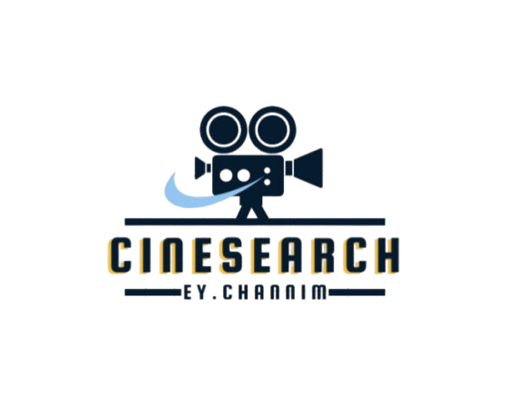

# Welcome to **CineSearch**

`CineSearch` is a movie finder website designed to help you discover your next favorite movie. Whether you're a fan of the latest blockbusters, classic films, or even TV series and episodes, **CineSearch** makes it easy to search, explore, and discover movies across genres.

With real-time results, detailed information, and a user-friendly interface, **CineSearch** enhances your movie-watching experience with a seamless and enjoyable search.

## 📢 **CineSearch** Logo



# 🌟 **Main Features of CineSearch:**

## 🎬 **Movie Search Functionality:**

### 🔍 Two Input Fields:

- **Title Input**: Enter the movie title (or part of it).
- **Type Selection**: Choose between **Movie** or **Series** to narrow down your search.

### 🖱️ **Search Button**:

- Triggers the search process based on the entered criteria.

## 📑 **Displaying Results:**

- If matching movies are found, they will be displayed under the search box.
- If no results are found, the message **"Movie not found!"** is shown.

## 📄 **Pagination for Easy Browsing:**

- OMDB API returns only the first **10 results** by default.
- **Pagination Buttons**: Buttons numbered **1**, **2**, **3**, etc., allow navigation between pages of search results.
- Clicking a pagination button triggers a new AJAX request to fetch the next set of results.

## 🎥 **Movie Details:**

- Each movie listing comes with a **Details** button.
- Clicking the **Details** button displays in-depth information such as plot, cast, release year, and more.
- All details are shown on the same page without the need for a page refresh.

---

## 🚀 **Why Choose CineSearch?**

At **CineSearch**, we strive to provide the best movie search experience. Here’s why you should choose us:

- 🎬 **Comprehensive Search:**
  Easily search for movies, series, and episodes using detailed criteria such as titles and types. **CineSearch** covers everything, from the latest blockbusters to hidden gems!

- 🖥️ **Easy-to-Use Interface:**
  The interface is designed to be simple and user-friendly. With intuitive search bars and filters, you can quickly find what you're looking for without any hassle.

- 📑 **Pagination for Easy Browsing:**
  With built-in pagination, **CineSearch** allows you to easily navigate through large result sets. No more endless scrolling or waiting for large result pages to load.

- 📖 **Detailed Movie Information:**
  Get detailed movie information, including plot summaries, cast lists, release years, and more, all with a simple click of the **Details** button.

- 🎯 **All-in-One Solution:**
  Whether you're searching for a specific movie, exploring a genre, or just browsing, **CineSearch** is your all-in-one solution for movie discovery.

- 🔧 **Customizable and Scalable:**
  As a growing platform, **CineSearch** can be easily customized with new features and enhancements to keep up with user needs and the latest trends in cinema.

---

## Installation

To run the **CineSearch** application locally:

### 1. Clone the repository:

```bash
git clone https://github.com/ChannimEY/Cinesearch.git
```

### 2. Navigate to the project directory:

```bash
cd Cinesearch
```

### 3. Open the `index.html` file in your browser.

## 🛠 Tech Stack

My project is built using the following technologies:

### 🌐 Frontend:

- **HTML** - The standard markup language for structuring web pages.
- **CSS** - Styles the website for a visually appealing UI.
- **JavaScript** - Adds interactivity and dynamic content to the frontend.

### ⚙️Deployment:

- **Vercel** - Deployment platform for frontend hosting

## 😍 **CineSearch Slogan**

**The Smart Way to Find Movies - Only at CineSearch.**
